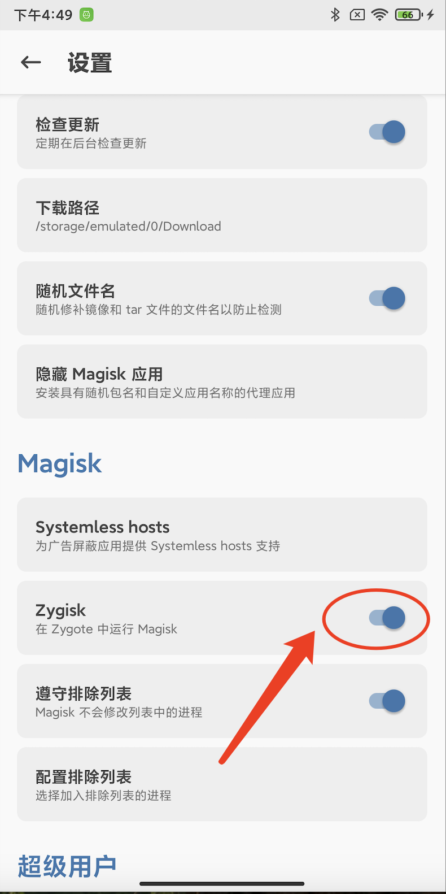
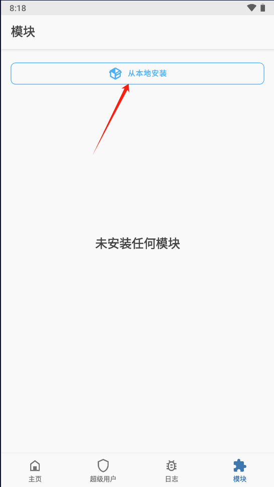

# DroidPrivacy 使用说明

## 概述

本文档将引导您完成DroidPrivacy工具的完整使用流程，从环境准备到检测结果分析。

## 使用前准备

### 1. 系统要求

**系统要求**：本工具基于LSPosed框架，支持Android 8.1至Android 14系统。

### 2. 环境配置

#### 2.1 设备Root权限获取

**物理设备**：请准备一台已成功获取Root权限的Android设备。

**模拟器环境**：如无可用Root设备，建议使用Root Android模拟器构建测试环境。推荐采用Android Studio官方模拟器进行配置。

**Android模拟器Root配置参考：**
- [rootAVD - GitHub](https://github.com/newbit1/rootAVD)
- [Android模拟器root教程 - 阿里云](https://xz.aliyun.com/t/12476?time__1311=mqmhD5AKYKGIeDqGXg4CqxKxu71k%2B%3Dx&alichlgref=https%3A%2F%2Fwww.google.com.hk%2F)
- **兼容性说明**：rootAVD方案并非支持所有模拟器版本，经测试验证可成功Root的版本包括Android 10.0 (Google APIs) arm64-v8a

#### 2.2 Magisk框架安装

**版本要求**：
- **最低版本要求**：Magisk v24.0+
- **推荐版本**：Magisk v30.1+

**安装方式**：
1. **手动安装**：自行从[Magisk - GitHub](https://github.com/topjohnwu/Magisk)下载安装
2. **自动部署**：使用rootAVD工具Root模拟器时将自动部署Magisk框架

#### 2.3 LSPosed框架安装

**安装模式选择**：
LSPosed框架支持两种部署模式，请根据设备兼容性及Android版本选择：
- **Riru模式**：适用于Android 8.1+系统，传统兼容模式（⚠️ 已停止维护）
- **Zygisk模式**：推荐模式，适用于Android 8.0+系统，性能更优，持续更新

**推荐使用Zygisk模式的原因**：
- Riru项目已于2022年停止维护，不再接收安全更新
- Zygisk是Magisk官方推荐的现代化解决方案
- Zygisk具有更好的性能和稳定性
- 对新版本Android系统支持更完善

**Zygisk安装模式（推荐）**：

1. **启用Zygisk**：
   - 启动Magisk Manager应用
   - 导航至"设置"配置页面
   - 启用"Zygisk"功能选项

   

2. **安装LSPosed**：
   - 将Zygisk版本LSPosed模块文件传输至目标设备
   - 启动Magisk Manager应用
   - 导航至"模块"管理页面
   - 选择"从本地安装"选项
   - 选择LSPosed模块文件执行安装
   - 重启设备完成安装

   

   **官方下载**：[LSPosed - GitHub](https://github.com/LSPosed/LSPosed/releases)

### 3. 重要提醒

⚠️ **安全注意事项**：
- Root操作存在风险，请在测试设备上进行操作
- 操作前请备份重要数据

## 使用流程

### 第二步：下载和安装工具

1. **下载工具**
   - 从项目发布页面下载最新版本的APK文件

2. **安装应用**
   - 将APK文件传输到设备并安装

3. **在LSPosed中启用模块**
   - 打开LSPosed管理器
   - 找到"DroidPrivacy"模块并启用

4. **勾选应用**
   - 点击模块进入应用列表
   - 勾选需要检测的应用
   - 支持多选应用同时检测

### 第三步：配置检测规则

1. **打开DroidPrivacy应用**
   - 启动应用，进入主界面
   - 您将看到检测规则列表

2. **勾选检测规则**
   - 勾选需要检测的隐私行为类型
   - 支持全选/取消全选操作
   - 可以展开/折叠规则分类

**重要提醒：不建议勾选所有检测规则**

**高频调用规则（会产生大量记录）：**
- **系统属性（包含设备信息、网络状态、SIM卡状态等多种系统属性读取）**：应用频繁调用SystemProperties获取系统信息
- **网络信息（包含网络类型、连接状态等频繁调用的网络相关API）**：网络状态检查、连接状态等调用频繁

**建议配置策略：**
1. **按需选择**：根据实际检测需求选择相关规则，避免全选
2. **重点关注**：优先选择高敏感度规则（标记为"高敏"的项目）
3. **分阶段检测**：可以分多次检测，每次选择不同类别的规则
4. **性能考虑**：减少不必要的规则可以降低性能影响和文件大小

3. **保存配置**
   - 点击"保存配置"按钮
   - 系统会提示配置已保存

> 📖 **详细说明**：关于检测规则的详细信息，请查看[检测规则说明](detection_rules.md)

### 第四步：开始检测

1. **启动目标应用**
   - 打开需要检测的应用
   - 观察是否出现"开始检测xx"的Toast提示

2. **执行应用操作**
   - 正常使用目标应用
   - 触发各种功能以产生隐私API调用

3. **观察检测日志**
   - 在LogCat中过滤"DroidPrivacy"标签
   - 观察检测到的隐私API调用

### 第五步：查看检测结果

1. **打开结果设置页面**
   - 在DroidPrivacy应用中点击"结果设置"
   - 查看检测结果文件路径

2. **获取检测结果**
   - 等待20~30秒确保结果写入完成（高并发/大量调用建议等待约60秒）
   - 从指定路径获取检测结果文件
   - 结果文件包含详细的API调用信息

3. **分析检测结果**
   - 查看调用的API类型
   - 分析调用频率和时机
   - 识别潜在的隐私风险

## 高级功能

### 手机品牌模拟

1. **打开检查工具页面**
   - 在主界面点击"检查工具"
   - 进入工具页面

2. **配置品牌模拟**
   - 选择需要模拟的手机品牌
   - 点击"应用设置"保存配置
   - 重启设备使设置生效

3. **验证模拟效果**
   - 启动目标应用
   - 检查应用是否按模拟品牌执行不同逻辑

### 重载调用过滤

**功能说明**：重载调用过滤功能默认开启，用于过滤重载方法之间的重复调用记录。

1. **启用过滤功能**
   - 在检查工具页面找到"重载调用过滤"选项
   - 该功能默认开启，可手动关闭

2. **注意事项**
   - 当前过滤功能可能不够完善
   - 部分重复调用可能无法过滤
   - 分析结果时需要注意此情况

> 📖 **详细说明**：关于重载调用过滤的详细实现原理，请查看[常见问题解答](faq.md#什么是重载调用过滤)

### 模拟发送系统广播和测试接收广播自启

**功能说明**：模拟发送系统广播，用于测试应用接收广播的情况和自启动行为。
   - **测试广播接收**：模拟发送系统广播，观察目标应用是否注册了广播监听器并响应
   - **测试自启动行为**：在某些规定中，接收广播导致应用启动会被判定为自启动，该功能用来测试该情况

**⚠️ 重要提醒：**
- 部分系统广播可能导致桌面应用崩溃，建议在测试环境中谨慎使用
- 建议先测试非关键应用，避免影响系统稳定性
- 如遇到应用崩溃，可重启应用或设备恢复正常

> 📖 **详细说明**：关于系统广播发送的详细实现原理，请查看[常见问题解答](faq.md#什么是系统广播发送)

## 常见问题处理

### 工具未正常运行

1. **检查环境**
   - 确认设备已Root
   - 确认Magisk和LSPosed已正确安装
   - 确认DroidPrivacy模块已启用

2. **检查配置**
   - 确认目标应用已在LSPosed中勾选
   - 确认检测规则已正确配置

3. **重启设备**
   - 虽然大部分配置变更理论上无需重启，但在实际使用中可能会遇到各种异常情况，此时重启是可尝试的解决方案

### 检测结果为空

1. **应用选择**：确认目标应用已在LSPosed中勾选
2. **检测规则**：确认已选择相应的检测规则
3. **应用操作**：确认已执行可能触发隐私API的操作

### 检测结果不准确

1. **检查过滤设置**
   - 确认重载调用过滤设置合理
   - 必要时关闭过滤功能

2. **检查品牌模拟**
   - 确认品牌模拟设置正确
   - 必要时关闭模拟功能

## 问题反馈

如在使用过程中遇到问题，请参考[问题反馈指南](feedback.md)获取完整的反馈指导。

## 相关链接

- [Magisk官方文档](https://topjohnwu.github.io/Magisk/)
- [LSPosed官方文档](https://lsposed.github.io/)
- [rootAVD项目](https://github.com/newbit1/rootAVD)

---

> 📝 **注意**：本工具仅用于隐私检测，不提供合规判定。具体的合规性评估需要结合相关法律法规、应用市场规范等要求进行综合判断。